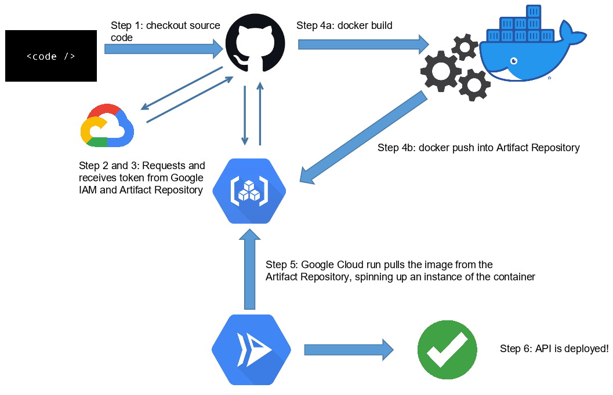
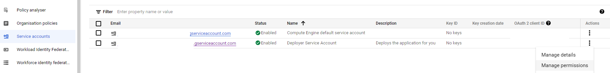
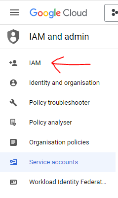

# Building and Running locally
* `git clone https://github.com/ngmysamuel/simplecppcalculator.git`
*  `g++ src/app.cpp -o out -lws2_32`
* `./out.exe`

# Building and Running using GitHub Actions
* Simply push!
    * Step 1: Checkout.
        * This step checks out the code - similar to what you would do in the local build and run step
    * Step 2: Google Auth
        * This authenticates your entire workflow with Google. We will be using their Artifact Repository to store our built image as well as Google Cloud Run to deploy our image.
        * TODO: make a move to Docker Hub?
    * Step 3: Docker Auth
        * Actually authenticates into the Artifact Repository
    * Step 4: Build and Push Container
        * Runs `docker build` and `docker push`
    * Step 5: Deploy to Cloud Run
        * The deployment phase where the image becomes an instance running on Google's cloud infra.
    * Step 6: Show Output
        * Syntactic sugar to provide easy access to the deployed endpoint  

## Troubles faced
* Google's documentation on permissioning for GitHub Actions was extremely hard to understand
    * [Workload Identity Federation](https://cloud.google.com/iam/docs/workload-identity-federation)
    * Creation of service accounts, Workload identity pools, Workload identity pool providers, OIDC, local JWKs, attribute mappings, CEL expressions, etc
* After deploying to Cloud Run, there was an extra step needed to disable Authentication. 
* Small issues 
    * outdated tutorials
    * wrong issuer URI when setting up Federated Identity
    * wrong URI concatenation (missing image name) in docker build/push
    * understanding what Google's Artifact Repository's location meant
* Had to grant permissions but was looking in the wrong place

Actual page to grant the roles was at another page  

## Helpful Links
* [Where to get C++ compiler](https://www.mingw-w64.org/downloads/)
* [How to download w64devkit](https://github.com/skeeto/w64devkit)

### Less Helpful Links
* [Setting up Identity Federation and allowing GitHub Actions](https://cloud.google.com/blog/products/identity-security/secure-your-use-of-third-party-tools-with-identity-federation)
* [Helper with the above](https://mahendranp.medium.com/gcp-workload-identity-federation-with-github-actions-1d320f62417c)
* [Deployment Specific - did not really make use of this](https://cloud.google.com/blog/products/devops-sre/deploy-to-cloud-run-with-github-actions)
* [GitHub's perspective on the first link - correct URI found here](https://docs.github.com/en/actions/deployment/security-hardening-your-deployments/configuring-openid-connect-in-google-cloud-platform)
* [List of GCP Locations](https://cloud.google.com/artifact-registry/docs/repositories/repo-locations)